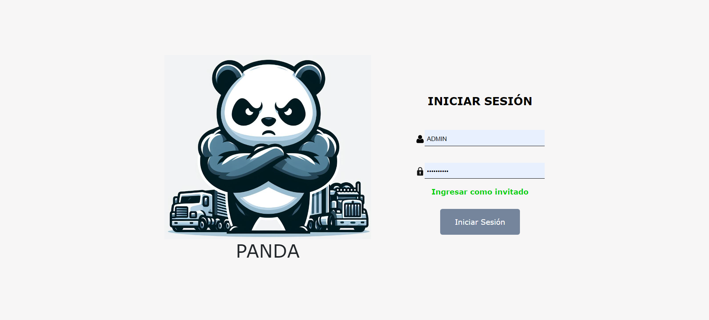

# Frontend Project Documentation for Transport Company PANDA

## Project Description
This frontend project, developed using React, Ant Design, and Bootstrap, is designed to interact with the backend API built with Spring Boot. It facilitates the management of records for workers, drivers, trucks, carts, and users within a transportation company context. The application offers role-based access control, allowing only administrators to perform operations such as adding, updating, or deleting data. User management functionality is exclusively available to administrators. The project extensively utilizes React hooks (such as useState and useEffect), props, routes, React context, and Redux for state management.

## Key Features
- Role-Based Access Control: Administrators have exclusive access to functionalities such as adding, updating, or deleting data.
- User Management: Administrators can manage user accounts, including creation, deletion, and modification.
- Integration with Backend API: Utilizes Axios to consume the backend API built with Spring Boot, enabling seamless communication between frontend and backend.
- UI Components: Utilizes Ant Design and Bootstrap for building responsive and visually appealing user interfaces.
- State Management: Utilizes React hooks (useState, useEffect), props, React context, and Redux for efficient state management across components.
## Technologies Used
- React: JavaScript library for building user interfaces.
- Ant Design: Design system for building enterprise-level UIs.
- Bootstrap: Frontend framework for building responsive and mobile-first websites.
- Axios: Promise-based HTTP client for making AJAX requests.
- React Hooks: Feature introduced in React 16.8 for state management and lifecycle methods.
- React Router: Library for routing in React applications.
- React Context API: Feature in React for passing data through the component tree without having to pass props down manually.
- Redux: Predictable state container for JavaScript apps.

  

## Installation and Setup
To set up the frontend project locally, follow these steps:

1. Clone the repository from GitHub.
2. Navigate to the project directory in your terminal.
3. Install dependencies using npm or yarn: npm install or yarn install.
4. Start the development server: npm start or yarn start.
5. The application will be accessible in your web browser at http://localhost:3000.
## Usage
Upon accessing the application, users will be prompted to log in. Only administrators will have access to functionalities such as adding, updating, or deleting data and managing user accounts. Non-administrator users will have limited access. Navigate through the different sections of the application to perform various operations related to transportation management.
## Contribution
Contributions to this project are welcome. Please feel free to open an issue or submit a pull request on GitHub.
## Contact
For further inquiries, please contact Jefferson Panta at Pantajefferson173@gmail.com.